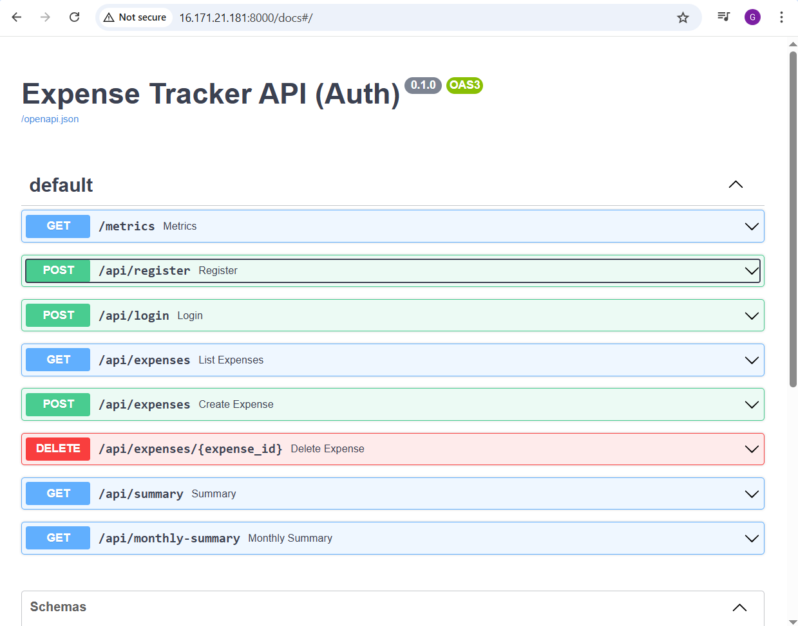
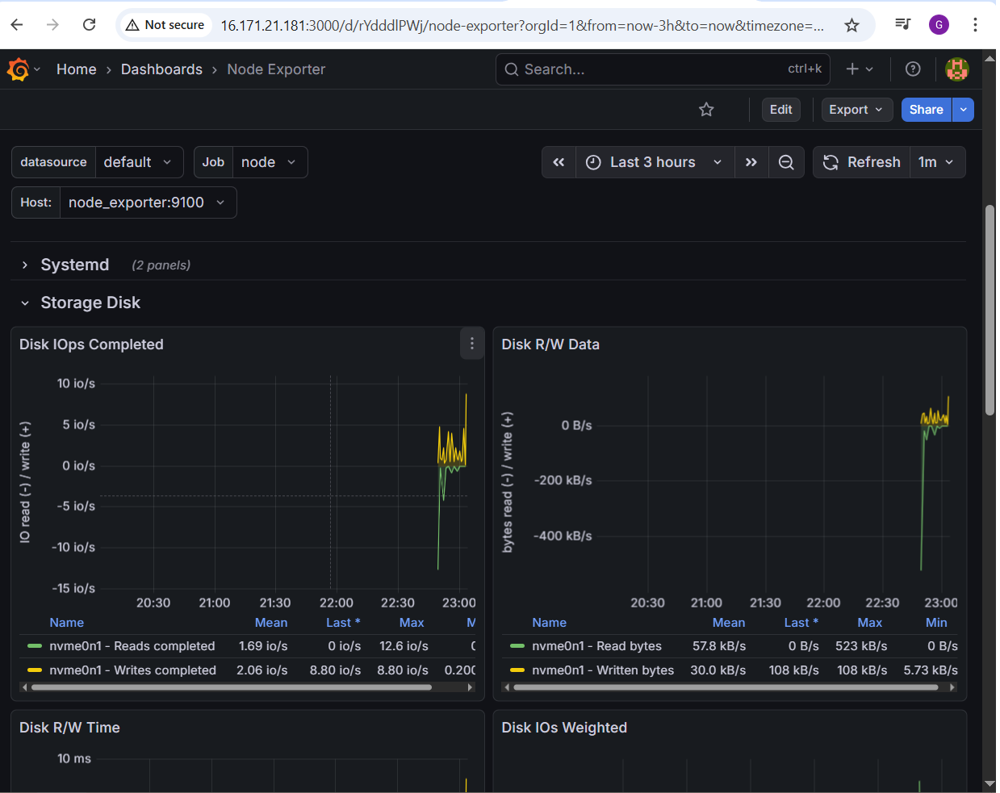
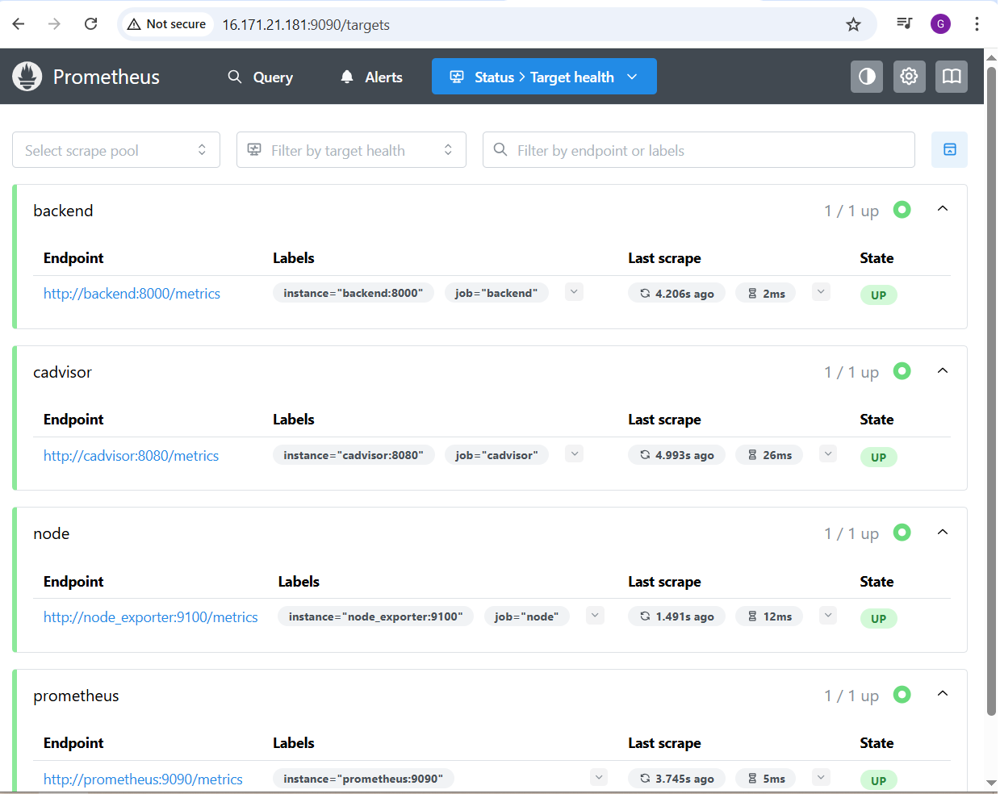
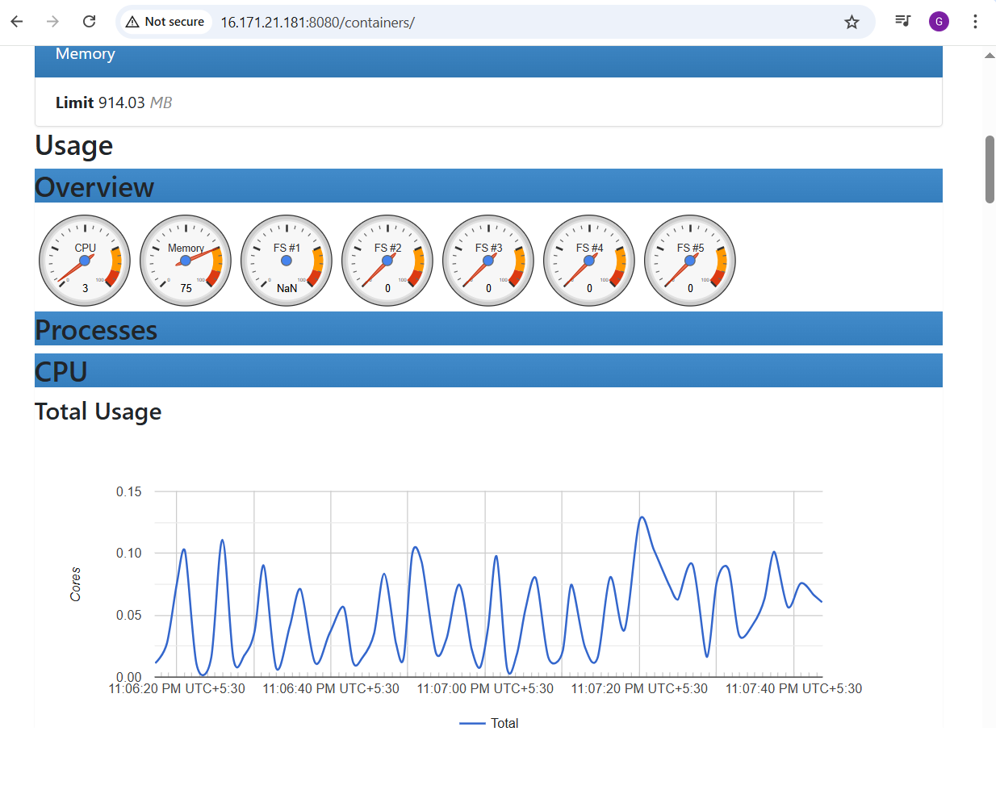
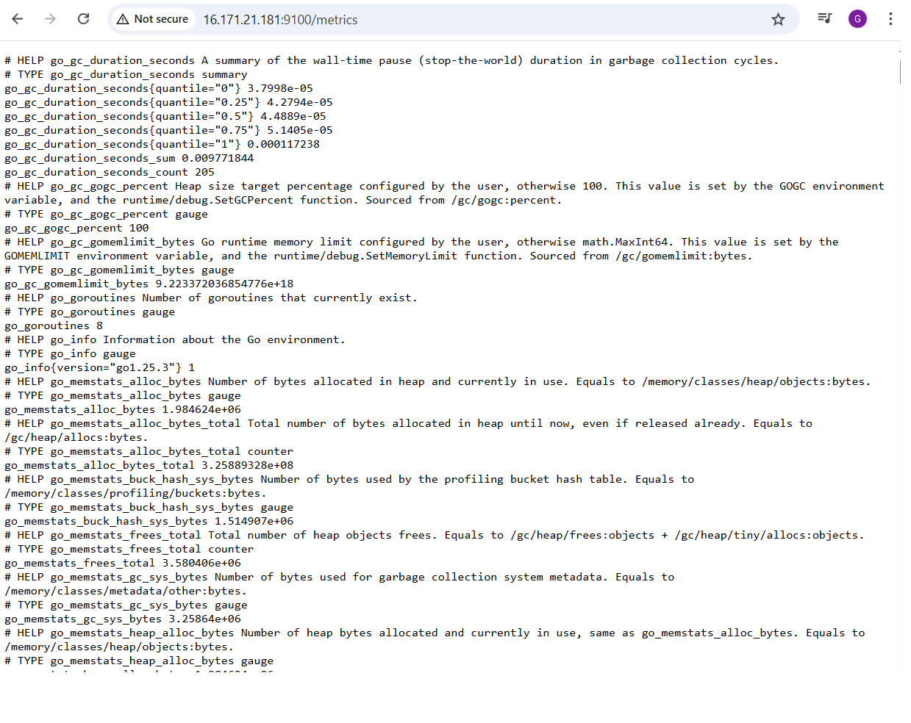
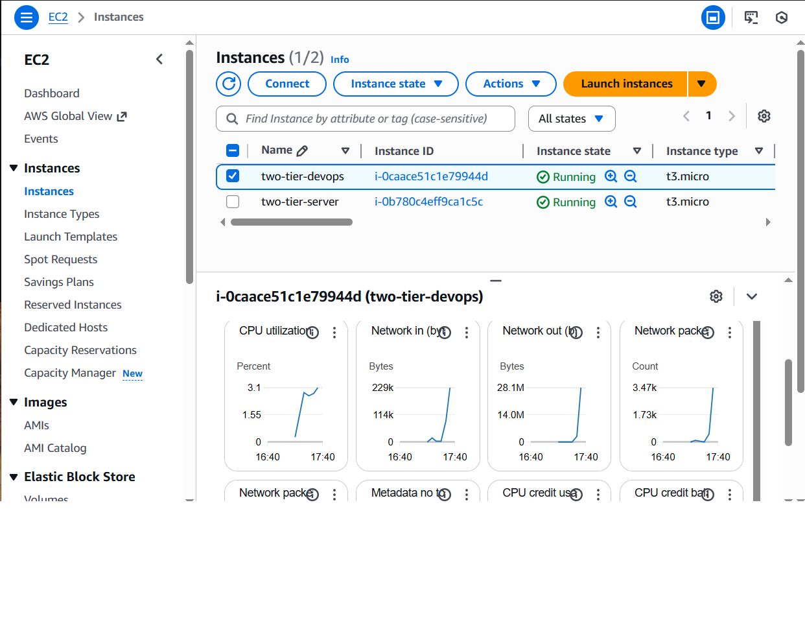

# 🚀 Two-Tier DevOps Project — Expense Tracker Application

A complete **Two-Tier Expense Tracker Application** deployed on **AWS EC2** using **Docker, Nginx, Prometheus, Grafana, cAdvisor, Node Exporter**, and fully automated provisioning via **Terraform**.

This project demonstrates full-stack development, containerization, monitoring, infrastructure automation, CI/CD, and cloud deployment.

---

## 📌 **Architecture Diagram**


---

# 🌐 Live Application (Hosted on EC2)

| Component | URL |
|----------|-----|
| **Frontend** (Port 80) | `http://<your-EIP>` |
| **Backend (FastAPI Docs)** | `http://<your-EIP>:8000/docs` |
| **Prometheus** | `http://<your-EIP>:9090` |
| **Grafana** | `http://<your-EIP>:3000` |
| **cAdvisor** | `http://<your-EIP>:8080` |
| **Node Exporter Metrics** | `http://<your-EIP>:9100/metrics` |

> Replace `<your-EIP>` with your Elastic IP.

---

# 📂 **Project Overview**

### ✔ Backend  
- Built using **FastAPI + PostgreSQL**  
- Implements JWT authentication  
- CRUD operations for expenses  
- Exposes `/metrics` endpoint for Prometheus  
- Fully containerized

### ✔ Frontend  
- React dashboard  
- Login/Register  
- Add & List expenses  
- Category chart + Monthly trend  
- Built and served via **Nginx**

### ✔ Monitoring & Observability  
| Tool | Purpose |
|------|---------|
| **Prometheus** | Scrapes all metrics |
| **Grafana** | Dashboards for system & app |
| **Node Exporter** | Host-level metrics |
| **cAdvisor** | Docker container monitoring |

### ✔ Infrastructure (Terraform)
- Creates:
  - EC2 instance
  - Security group
  - Elastic IP
  - SSH key pair

---

# 🛠 **Tech Stack**

### **Backend**
- Python FastAPI  
- PostgreSQL  
- SQLAlchemy  
- Uvicorn  
- Prometheus Client

### **Frontend**
- React  
- Chart.js  
- Nginx  

### **DevOps**
- Docker  
- Nginx reverse proxy  
- Prometheus  
- Grafana  
- Node Exporter  
- cAdvisor  
- Terraform  
- GitHub Actions (CI/CD)

---

# 🧱 **Screenshots**

---

## 🔹 **1. FastAPI Backend — Swagger API Docs**



---

## 🔹 **2. Frontend UI — Expense Tracker Dashboard**


---

## 🔹 **3. Grafana — List of Dashboards**


---

## 🔹 **4. Grafana — Node Exporter Dashboard**



---

## 🔹 **5. Prometheus — Target Health**



---

## 🔹 **6. cAdvisor — Container Resource Monitoring**



---

## 🔹 **7. Node Exporter Metrics (Raw)**



---

## 🔹 **8. AWS EC2 Overview**


---

## 🔹 **9. Two-Tier DevOps EC2 Instance Details**



---

# 📦 **Docker Compose Setup**

```bash
docker compose up -d --build
Creates containers:

Service	Port
backend	8000
frontend (via Nginx)	80
postgres	internal
prometheus	9090
grafana	3000
node_exporter	9100
cadvisor	8080

⚙️ CI/CD with GitHub Actions
Backend Workflow
.github/workflows/backend-ci.yml

Install dependencies

Run tests

Build docker image

Frontend Workflow
.github/workflows/frontend-ci.yml

Install Node dependencies

Build React

Lint

CD Workflow
You can extend this to auto-deploy to EC2 using SSH or GitHub Runner.

☁️ Terraform Infrastructure
Resources Created
✔ EC2 Instance
✔ Security Group
✔ Elastic IP
✔ SSH Key Pair

Deploy Infrastructure
bash
Copy code
terraform init
terraform apply -auto-approve
🚀 How to Deploy on EC2
ssh -i your-key.pem ubuntu@your-EIP

Install Docker

Clone repo:

bash
Copy code
git clone https://github.com/<your-username>/Two-Tier-DevOps.git
cd Two-Tier-DevOps
Run:

bash
Copy code
docker compose up -d --build
📝 Future Improvements
Implement GitHub Actions CD pipeline to auto-deploy

Add alerting rules in Prometheus

Add Loki + Promtail for log aggregation

Use RDS instead of local Postgres

Build AMI using Packer

👤 Author
Gagandeep Singh
DevOps & Cloud Engineer
GitHub: https://github.com/gagansingh3467-pixel
